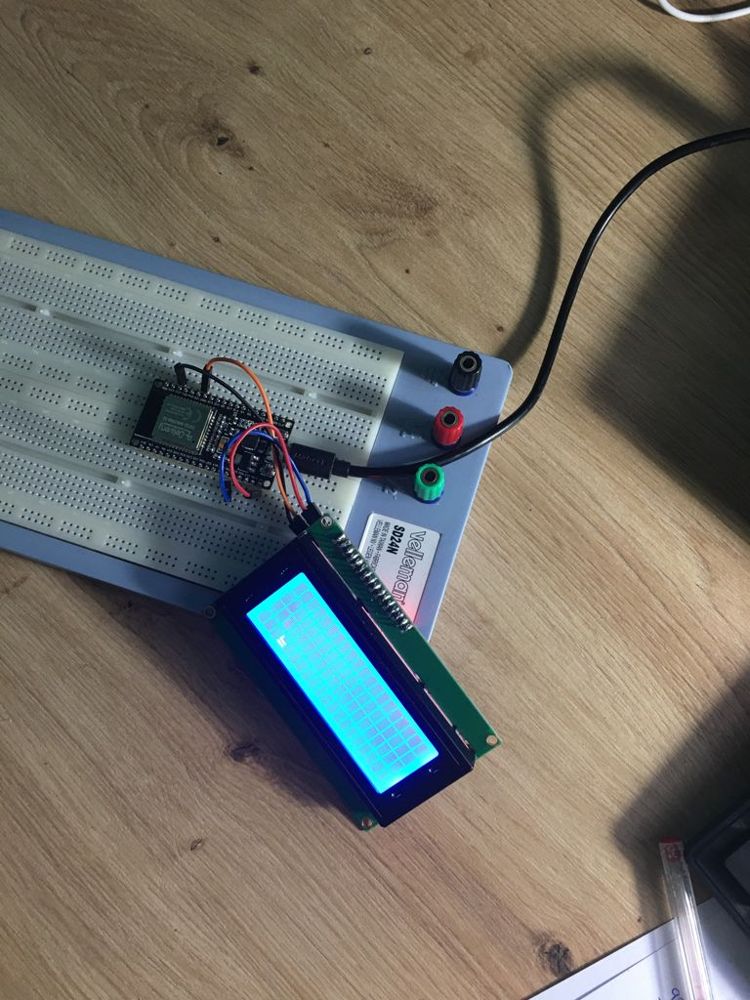

## **EJERCICIO PRÁCTICO 2**

Para realizar esta parte de la práctica he usado una pantalla LCD de 20x4 que tenía por casa y un módulo i2C para ahorrar pines en la placa.


El código lo empiezo incluyendo la librería LiquidCrystal_i2C la cuál nos permitirá trabajar más fácilmente con este módulo ya que alguien ya se ha encargado de crear funciones y la comunicación entre el módulo y la placa.

Creamos un objeto llamado lcd con las propiedades siguientes: 0x27, 20,4. Configuramos la dirección de la LCD, el número de columnas y el de filas.

```cs
#include <Arduino.h>
#include <Wire.h> 
#include <LiquidCrystal_I2C.h>

LiquidCrystal_I2C lcd(0x27,20,4);  //sometimes the LCD adress is not 0x3f. Change to 0x27 if it dosn't work.

```
Lo siguiente que es importante hacer está en la parte del setup, donde inicializaremos la pantalla mediante la función *lcd.init()*.
Encendemos la luz de la pantalla con la función *lcd.backlight()* que indagando un poco en la librería que habíamos incluido, vemos que al llamar esta función lo que se hace es signar a la variable _backlightval=LCD_BACKLIGHT

```cs

void setup() {

  lcd.createChar(0, customChar);

  lcd.init();                 //Init the LCD
  lcd.backlight();            //Activate backlight
  
  lcd.clear();
  lcd.setCursor(1,0); 
  lcd.print("PRACTICA 5 ALBERT");
  delay(1000);
  lcd.setCursor(4,1);
  lcd.print("VERSIO 1.0");
  delay(1000);
}

```
**CREACIÓN DE LA FIGURA**  

Lo que he querido hacer en la páctica es crear un símbolo en hexadecimal y que se vaya moviendo por la pantalla.
Para eso hay que aclarar una cosa: La pantalla está compuesta por 20 columnas y 4 filas. Cada fila/columna tiene un rectángulo dónde se muestra la información que está compuesto por 8x5 píxeles cada uno.

Para hacer la figura he usado una página web la cuál señalizando los píxeles que se desean iluminar, nos crea un código en hexadecimal.
El código que yo he usado es el siguiente:
```cs
byte customChar[] = {
  0x00,
  0x00,
  0x10,
  0x19,
  0x1F,
  0x19,
  0x10,
  0x00
};
```
Creamos una lista llamada customChar de tipo byte la cuál vamos a enviar mediante una función y se guardará en la memoria de la pantalla para cuando queramos reproducir la figura, poder usarla. 
Para enviar este código a la pantalla debemos usar la función   *lcd.createChar(0, customChar);* que mirando la librería vemos que en el primer campo tenemos que poner una localización de 0-7 y como segundo campo le pasamos la lista anteriormente creada.  


**VISUALIZACIÓN EN LA PANTALLA**  

Para visualizar letras en la pantalla usamos la función *lcd.print("")*.
Para señalizar en que parte de la pantalla se quiere visualizar hay varias formas:
    - lcd.home() te sitúa en el (0,0)
    -lcd.setCursor(x,y) mediante x,y puedes señalizar donde quieres situarlo.

Para ver la figura anteriormente creada moviéndose he hecho un bucle muy sencillo el cuál hace que una variable *i* vaya de 0 a 20, de forma lo moveremos en el eje x con la función *setCursor* y otro bucle dentro de este que hace que otra variable *j* vaya de 0 a 4, de esta forma se podrá mover por las filas de la pantalla.  

## CONCLUSIONES ##
En este ejercicio práctico no he tenido muchos problemas ya que anteriormente con otro proyecto ya aprendí como funciona este tipo de pantalla con este módulo y sabía defenderme con la librería que he incluido.
El único problema que me he encontrado ha sido a la hora de incluir la librería ya que me la he tenido que descargar para poder usarla en el Visual Studio Code. Aunque buscando un poco de información al respecto ha sido bastante sencillo resolver el problema.

## IMAGEN DEL MONTAJE

